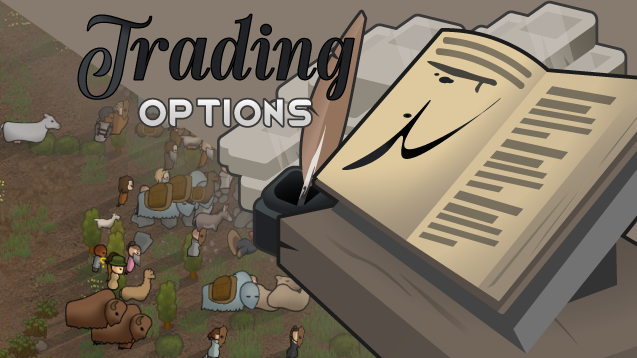

Trading Options
===

   

[Trading Options](https://steamcommunity.com/sharedfiles/filedetails/?id=ToDo) is a [RimWorld](https://rimworldgame.com/) mod which lets you customize your trading experience to your liking!

By tweaking the settings of this mod you can easily change:

• How frequently caravans, orbital traders or visitors will arrive at the colony.

• Amount of silver in stock for any trader type.

• Amount of other stock for any trader type.

• Make traders have more items in stock if your colony is wealthy.

• Slaver traders appear regardless of your colony population.

It is safe to add Trading Options to an existing savegame. You can safely modify any of the settings at any point during the game. Changes will only apply to new traders, and to settlements after they restock.

Trading Options is compatible with all mods that change the stock of a trader. The changes stack. Trading Options is probably incompatible with any mod that changes trader frequency.

Development
---

To compile this mod on Windows, you will need to install the [.NET Framework 4.7.2 Developer Pack](https://dotnet.microsoft.com/en-us/download/dotnet-framework/net472). On Linux the packages you need vary depending on your distribution of choice. Dependencies are managed using NuGet. Compiling this project does not require any [external dependencies or extra setup steps](https://ludeon.com/forums/index.php?topic=49914.0).

Contributions
---

This project encourages community involvement and contributions. Check the [CONTRIBUTING](CONTRIBUTING.md) file for details. Existing contributors can be checked in the [contributors list](https://gitlab.com/joseasoler/trading-options/-/graphs/main). The preview image was designed and created by [Sir Van](https://steamcommunity.com/id/UnVan/myworkshopfiles/?appid=294100).

License
---

This project is licensed under the MIT license. Check the [LICENSE](LICENSE) file for details.

Acknowledgements
---

Read the [ACKNOWLEDGEMENTS](ACKNOWLEDGEMENTS.md) file for details.
